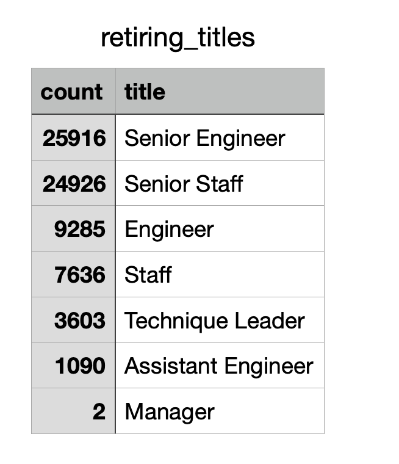

# Pewlett-Hackard-Analysis

## Overview

The purpose of this analysis was to determine the number of employees from Pwelett-Hackard who were retiring based on their job titles, and then using this information to identify employees who are eligible to be a part of a mentorship program. This analysis will help prepare for the 'silver tsunami' as there are a great many employees who are concurrently reaching retirement age. 

## Results

### Number of Employees Retiring by Title

As can be seen in the chart above, there are quite a few employees retiring soon from a myriad of job titles. Here are 2 key insights from this deliverable:

-A vast majority of the job titles from employees retiring are either senior engineers or senior staff

-There are only 2 managers retiring, depending on what their role is this may or may not have a large impact on the company as a whole

### Employees Eligible for the Mentorship Program

https://github.com/Smor-1/Pewlett-Hackard-Analysis/blob/main/Data/mentorship_eligibility.csv

The above csv file shows the employees that qualify for the mentorship program. Here are 2 key insights from this deliverable:

-There are more people retiring than potential mentors

-There are more than 1500 employees who qualify for this program

## Summary

### How many roles will need to be filled as the "silver tsunami" begins to make an impact?

There are approximately 72,000 roles that will need to be filled. 

### Are there enough qualified, retirement-ready employees in the departments to mentor the next generation of Pewlett Hackard employees?

Given that so many people will be retiring soon (>72,000) and there are only ~1500 potential mentors, this will be an arduous task to mentor the next generation of Pewlett Hackard employees. There is an approximately 1:48 ratio of mentors to positions that need to be filled. 

### Additional Queries

In order to provide more insight into the upcoming 'silver tsunami' we could add the following queries:
-A query that looks at a more narrow range of employees who will be retiring most immediately (i.e not a 4 year range) so as to determine if there is one year skewing the dataset to have a large number of retirees in a particular year
-We could also add a query that determines mentorship eligibility by position title - this would allow us to determine the breakdown of mentors to most effectively devise a mentorship program and indicate if there is a need to hire external sources to help train the future employees
